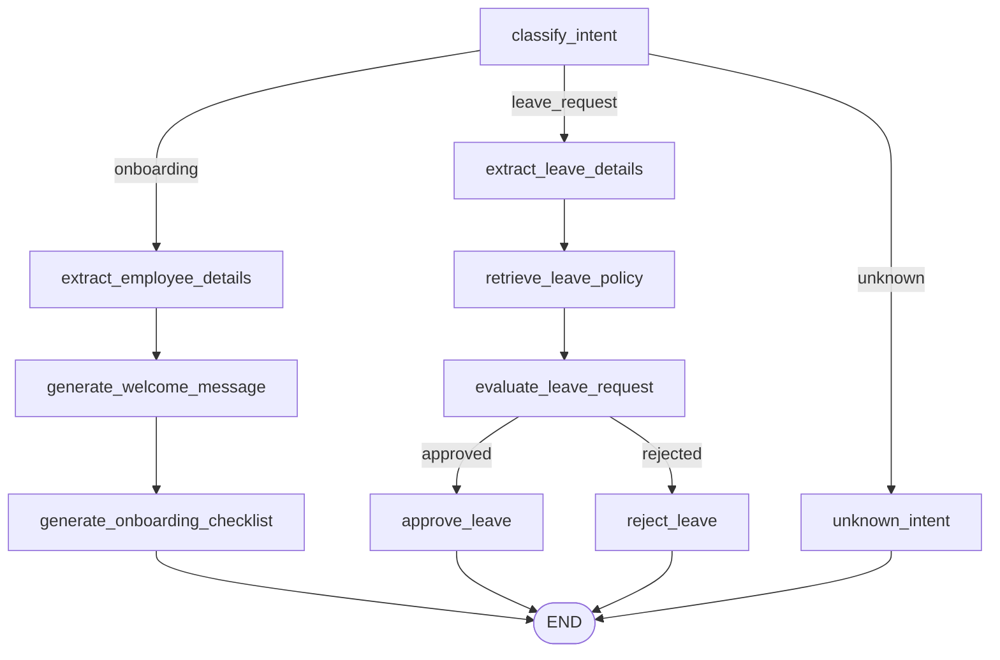

# HR Agent — v1 Documentation

## 1. Overview

The HR Agent is a LangGraph-based conversational agent that automates two
core HR workflows from a single free-text message:

- **Employee onboarding** — extracts new-hire details and generates a
  welcome message plus an onboarding checklist.
- **Leave requests** — extracts leave details (type, dates, reason),
  retrieves relevant HR policy context, evaluates whether the request can
  be auto-approved, and generates a response.

It is exposed to the rest of the AI Employee Suite backend as a single
FastAPI endpoint, `POST /hr/message`, so any client (frontend, another
service, a test harness) can drive it over HTTP without depending on
LangGraph directly.

The agent's underlying LLM calls use Groq (`llama-3.3-70b-versatile`) via
`langchain_groq.ChatGroq`, configured once in
`backend/app/core/llm_client.py`. Every node that calls the LLM degrades to
a deterministic fallback response if the call fails, so a Groq outage never
crashes the graph.

## 2. Architecture

The HR Agent is built on a shared scaffold used by every agent in this
repo (see `backend/app/agents/support_agent/` for the sibling
implementation):

```
FastAPI app (backend/app/main.py)
    │
    ├─ app.include_router(hr_router)
    │
backend/app/api/hr.py            <- HTTP boundary: request validation,
    │                                graph invocation, error handling
    │
backend/app/schemas/hr.py        <- Pydantic request/response contracts
    │
backend/app/agents/hr_agent/
    ├─ graph.py                  <- StateGraph wiring (nodes + conditional edges)
    ├─ nodes.py                  <- Node functions (business logic)
    ├─ state.py                  <- HRAgentState (TypedDict)
    ├─ extraction.py             <- Regex/keyword heuristics (name, role, dates, reason)
    ├─ rag.py                    <- Placeholder policy-document retrieval
    └─ prompts.py                <- LLM prompt templates
    │
backend/app/core/
    ├─ state.py                  <- AgentState (base fields shared by all agents)
    ├─ graph.py                  <- Minimal single-node scaffold graph (not used directly by HR)
    └─ llm_client.py             <- get_llm() factory (Groq client)
```

**Design principles carried through the implementation:**

- **Separation of HTTP from graph logic** — `api/hr.py` never touches
  LangGraph internals beyond `invoke()`; all HR-specific reasoning lives in
  `agents/hr_agent/`.
- **Partial-state-update node contract** — every node returns only the keys
  it changes; LangGraph merges updates into the running state. Nodes never
  overwrite a field the caller (or an earlier node) already supplied.
- **Isolated per-agent state** — `HRAgentState` extends the shared
  `AgentState` rather than modifying it, so the Support Agent and any future
  agent are unaffected by HR-specific fields.
- **Graceful LLM degradation** — `_invoke_llm()` in `nodes.py` centralizes
  LLM error handling; every prompt-driven node has a deterministic,
  readable fallback string.

## 3. Workflow Explanation

### Onboarding

1. A message like *"Please onboard John Doe as a Backend Engineer starting
   next week"* arrives.
2. The intent classifier recognizes it as onboarding.
3. Employee name, role, and start date are extracted via regex heuristics
   (falling back to `"Unknown"` per field if nothing is found).
4. A short, LLM-generated welcome message is produced, referencing the
   extracted details.
5. A static onboarding checklist (offer letter, accounts, buddy assignment,
   orientation, payroll docs, equipment) is attached to the response.

### Leave Request

1. A message like *"Requesting sick leave from Aug 1 to Aug 3 because of a
   medical procedure"* arrives.
2. The intent classifier recognizes it as a leave request.
3. Leave type, start/end dates, and a free-text reason are extracted.
4. Relevant HR policy snippets are retrieved (keyword-matched against a
   placeholder policy set).
5. The request is evaluated: it auto-approves only if type and both dates
   were successfully extracted; otherwise it is routed to manual HR review
   (the reason is informational context, not a gating condition, since some
   leave types — e.g. sick leave — don't require justification per policy).
6. A final LLM-generated message confirms approval or explains that the
   request needs manual review — the rejected branch is carefully worded
   to never imply the request was denied.

### Unknown / Fallback

Any message that doesn't match either workflow (or carries no usable
input) returns a clarification message asking the user to specify
onboarding or leave.

This deliberately includes messages that *mention* leave but aren't a new
time-off submission -- leave policy questions ("what's our policy on
parental leave?"), balance inquiries ("how many vacation days do I have
left?"), and status checks on an already-submitted request. `evaluate_leave_request_node`
only knows how to auto-approve/flag-for-review a **new** request; earlier
testing found that classifying these as `leave_request` anyway produced a
misleading response (e.g. telling someone who only asked a policy question
that "your leave request needs manual review"). `CLASSIFY_INTENT_PROMPT`
now explicitly routes them to `unknown` instead -- see [Known Limitations](#12-known-limitations).

## 4. Graph Diagram

`build_hr_graph()` in `backend/app/agents/hr_agent/graph.py` compiles the
following `StateGraph`:



Two conditional-edge selector functions drive routing:

- `_route_by_workflow(state)` — reads `state["workflow"]`, set by
  `classify_intent_node`; defaults to `"unknown"`.
- `_route_by_leave_decision(state)` — reads `state["leave_decision"]`, set
  by `evaluate_leave_request_node`; defaults to `"rejected"` so an
  unrecognized future decision value can never dead-end the graph.

### Nodes

| Node | Phase | Description |
|---|---|---|
| `classify_intent_node` | Entry | LLM call: single-word `workflow` classification (`onboarding` / `leave_request` / `unknown`). Drives the first conditional edge. |
| `extract_employee_details_node` | Onboarding | Regex/keyword extraction (see `extraction.py`) of `employee_name`, `employee_role`, `start_date`; defaults to `"Unknown"` per field. Never overwrites a pre-supplied field. |
| `generate_welcome_message_node` | Onboarding | LLM call: drafts the welcome message from the extracted details, with a deterministic fallback on LLM failure. |
| `generate_onboarding_checklist_node` | Onboarding | Attaches the static `ONBOARDING_CHECKLIST_TEMPLATE` (no LLM call). |
| `extract_leave_details_node` | Leave Request | Regex/keyword extraction of `leave_type`, `leave_start_date`, `leave_end_date`, `leave_reason`; defaults to `"Unspecified"`/`"Not specified"`. Never overwrites a pre-supplied field. |
| `retrieve_leave_policy_node` | Leave Request | Calls `rag.py`'s keyword-matched placeholder policy retrieval; try/except for graceful degradation. |
| `evaluate_leave_request_node` | Leave Request | Deterministic rule-based decision: auto-approves only if type and both dates were successfully extracted; otherwise routes to manual review. Drives the second conditional edge. |
| `approve_leave_node` | Leave Request | LLM call: drafts the approval confirmation, referencing policy context; deterministic fallback on failure. |
| `reject_leave_node` | Leave Request | LLM call: drafts the manual-review message (careful not to imply denial); deterministic fallback on failure. |
| `unknown_intent_node` | Fallback | Fixed clarification message, no LLM call. |

## 5. API Endpoints

| Method | Path | Description |
|---|---|---|
| `GET` | `/` | Backend liveness message |
| `GET` | `/health` | Health check (`{"status": "ok"}`) |
| `POST` | `/hr/message` | Run one message through the HR Agent graph |

### `POST /hr/message`

**Request body** (`HRAgentRequest`):

```json
{
  "user_input": "string, required, min length 1"
}
```

**Response body** (`HRAgentResponse`, HTTP 200):

```json
{
  "agent_response": "string",
  "workflow": "onboarding | leave_request | unknown",
  "employee_name": "string | null",
  "employee_role": "string | null",
  "start_date": "string | null",
  "onboarding_checklist": "string[] | null",
  "leave_type": "string | null",
  "leave_start_date": "string | null",
  "leave_end_date": "string | null",
  "leave_reason": "string | null",
  "leave_decision": "approved | rejected | null"
}
```

Only the fields relevant to the branch that actually ran are populated;
the rest are `null`.

**Error responses:**

| Status | Cause |
|---|---|
| `422 Unprocessable Entity` | Missing/empty/wrong-type `user_input`, or malformed JSON body (Pydantic validation, before the graph runs) |
| `500 Internal Server Error` | The graph raised an exception, or completed without producing an `agent_response` (both logged server-side via `logger.exception`/`logger.error`) |

## 6. Supported Features

- Intent classification between onboarding, leave request, and unknown.
- Employee detail extraction: name, role, start date (multiple phrasings:
  `"name is ..."`, `"new hire, ..."`, `"onboard(ing) ..."`, `"as a/an ..."`,
  `"role:"`, `"position:"`).
- Static onboarding checklist generation.
- Leave detail extraction: type (10 keyword categories), start/end dates
  (absolute and relative phrases), and free-text reason (`"because of"`,
  `"because"`, `"due to"`, `"reason:"`).
- Leave policy retrieval (keyword-matched placeholder knowledge base).
- Rule-based leave auto-approval / manual-review routing.
- LLM-generated welcome, approval, and manual-review messages with
  deterministic fallbacks on LLM failure.
- HTTP API with request validation and structured error handling.

## 7. Example Requests

**Onboarding:**
```bash
curl -X POST http://127.0.0.1:8000/hr/message \
  -H "Content-Type: application/json" \
  -d '{"user_input": "New hire, Jane Smith, joining as a Product Manager starting 2026-08-15."}'
```

**Leave request (auto-approved):**
```bash
curl -X POST http://127.0.0.1:8000/hr/message \
  -H "Content-Type: application/json" \
  -d '{"user_input": "Requesting sick leave from Aug 1 to Aug 3 because of a medical procedure."}'
```

**Leave request (manual review):**
```bash
curl -X POST http://127.0.0.1:8000/hr/message \
  -H "Content-Type: application/json" \
  -d '{"user_input": "I need to request leave, not sure of the dates yet."}'
```

**Unrelated / unknown:**
```bash
curl -X POST http://127.0.0.1:8000/hr/message \
  -H "Content-Type: application/json" \
  -d '{"user_input": "What is the weather like today?"}'
```

## 8. Example Responses

**Onboarding:**
```json
{
  "agent_response": "Welcome aboard, Jane! We're excited to have you join us as Product Manager. HR will reach out shortly to guide you through onboarding.",
  "workflow": "onboarding",
  "employee_name": "Jane Smith",
  "employee_role": "Product Manager",
  "start_date": "2026-08-15",
  "onboarding_checklist": [
    "Send offer letter and collect signed contract",
    "Provision company email and accounts",
    "Assign onboarding buddy / manager",
    "Schedule first-day orientation",
    "Collect tax and payroll documentation",
    "Set up workstation / equipment"
  ],
  "leave_type": null,
  "leave_start_date": null,
  "leave_end_date": null,
  "leave_reason": null,
  "leave_decision": null
}
```

**Leave request (auto-approved):**
```json
{
  "agent_response": "Your sick leave from Aug 1 to Aug 3 has been approved. Hope the procedure goes well!",
  "workflow": "leave_request",
  "employee_name": null,
  "employee_role": null,
  "start_date": null,
  "onboarding_checklist": null,
  "leave_type": "sick leave",
  "leave_start_date": "Aug 1",
  "leave_end_date": "Aug 3",
  "leave_reason": "a medical procedure",
  "leave_decision": "approved"
}
```

**Invalid input (422):**
```json
{
  "detail": [
    {
      "type": "string_too_short",
      "loc": ["body", "user_input"],
      "msg": "String should have at least 1 character",
      "input": ""
    }
  ]
}
```

## 9. Testing Summary

All HR Agent tests are deterministic and require no network access or
`GROQ_API_KEY` — the LLM is stubbed via `unittest.mock.patch` on
`backend.app.agents.hr_agent.nodes.get_llm`.

```bash
# Full HR Agent suite (97 tests)
python -m pytest test_hr_agent.py test_hr_agent_extraction.py test_hr_agent_nodes.py \
    test_hr_agent_graph.py test_hr_agent_comprehensive.py test_hr_agent_api.py -v

# Individual concern
python -m pytest test_hr_agent_extraction.py -v   # extraction heuristics
python -m pytest test_hr_agent_nodes.py -v        # node unit tests
python -m pytest test_hr_agent_graph.py -v         # conditional-edge routing
python -m pytest test_hr_agent_comprehensive.py -v # graph compilation, RAG, invalid input, state isolation
python -m pytest test_hr_agent_api.py -v           # FastAPI endpoint (happy path, validation, error handling)

# Cross-agent routing (deterministic; also exercises the Support Agent side)
python -m pytest test_cross_agent_routing.py -v

# Live-LLM accuracy regression (real Groq call; needs GROQ_API_KEY, auto-skips otherwise)
python -m pytest test_live_llm_accuracy.py -v
```

| Test file | Focus |
|---|---|
| `test_hr_agent.py` | End-to-end graph invocation, all three workflows |
| `test_hr_agent_extraction.py` | Pure regex/keyword extraction heuristics |
| `test_hr_agent_nodes.py` | Individual node behavior, LLM-failure fallbacks |
| `test_hr_agent_graph.py` | Conditional-edge selector functions |
| `test_hr_agent_comprehensive.py` | Graph compilation, RAG, invalid/empty input, state isolation |
| `test_hr_agent_api.py` | `/hr/message` HTTP contract, validation, error handling |
| `test_cross_agent_routing.py` | Support-domain input through the HR graph/API (and vice versa) stays isolated to `workflow="unknown"` |
| `test_live_llm_accuracy.py` | Real-Groq regression coverage for the `CLASSIFY_INTENT_PROMPT` fix (policy/balance/status questions must not be misrouted to `leave_request`) |

## 10. Project Structure

```
backend/
  app/
    main.py                       FastAPI app, router registration
    api/
      hr.py                       POST /hr/message
    schemas/
      hr.py                       HRAgentRequest / HRAgentResponse
    agents/
      hr_agent/
        graph.py                  build_hr_graph()
        nodes.py                  Node implementations
        state.py                  HRAgentState
        extraction.py             Name / role / date / leave-type / leave-reason heuristics
        rag.py                    Placeholder leave-policy retrieval
        prompts.py                LLM prompt templates
      support_agent/              Sibling agent, same scaffold
    core/
      state.py                    AgentState (shared base)
      graph.py                    Minimal shared scaffold graph
      llm_client.py                get_llm() -- Groq client factory
      config.py                   Env/config loading
    db/
      database.py                 SQLModel engine/session
test_hr_agent*.py                 HR Agent test suite (repo root)
test_cross_agent_routing.py       Cross-agent routing isolation (HR + Support)
test_live_llm_accuracy.py         Live-Groq classification accuracy regression (HR + Support)
HR_AGENT.md                       This document
HR_AGENT_TEST_REPORT.md           Test report: initial comprehensive suite
HR_AGENT_TEST_REPORT_LEAVE_AND_API.md  Test report: leave-reason + API coverage
WEEKLY_TESTING_SUMMARY.md         Weekly bug-fix / accuracy / testing summary
```

## 11. Future Improvements

- **A dedicated leave-inquiry workflow** — policy questions, balance
  checks, and status lookups on an existing request currently route to the
  `unknown` fallback (see [Known Limitations](#12-known-limitations)) rather
  than being answered directly; a read-only workflow branch for these would
  close that gap without touching the submission workflow.
- **Real semantic retrieval** — replace `rag.py`'s keyword matching with a
  vector store (pgvector/Chroma/Pinecone) over actual HR policy documents.
- **Structured LLM extraction** — replace the regex heuristics in
  `extraction.py` with LLM tool/function-calling for higher recall on
  free-text phrasing, or accept structured input from a real onboarding/
  leave-request form.
- **Real onboarding checklist source** — pull from an actual HRIS instead
  of the static template in `prompts.py`.
- **Real leave-balance and manager-approval workflow** — replace the
  rule-based auto-approval in `evaluate_leave_request_node` with an
  integration against actual leave balances and manager sign-off.
- **Authenticated employee identity** — derive employee/session details
  from an authenticated request context rather than parsing free text.
- **Conversation persistence** — `/hr/message` is currently stateless (one
  message in, one response out); a follow-up message doesn't remember the
  prior turn. Adding session/thread persistence (e.g. via LangGraph
  checkpointing) would enable multi-turn conversations.
- **Dependency manifest completeness** — `requirements.txt` does not yet
  list `langgraph`, `langchain-groq`, `pytest`, or `httpx`, all of which
  the agent and its test suite depend on; worth adding for reproducible
  installs.
- **FastAPI lifespan handlers** — `main.py` uses the deprecated
  `@app.on_event("startup")`; migrating to a `lifespan` context manager
  would remove the current `DeprecationWarning`.
- **Rate limiting / request logging** — no throttling or structured
  request logging exists yet at the API layer.

## 12. Known Limitations

- **No dedicated workflow for leave policy/balance/status questions.**
  `classify_intent_node` intentionally routes these to `unknown` rather than
  `leave_request` (fixed in this round of testing -- see
  `WEEKLY_TESTING_SUMMARY.md`), since `evaluate_leave_request_node` can only
  evaluate a *new* submission and previously produced a misleading "your
  request needs manual review" response for messages that were never a
  request at all. The `unknown` fallback message tells the user to contact
  HR directly for these until a dedicated workflow exists.
- **Extraction heuristics remain regex/keyword-based** (see `extraction.py`)
  — unusual phrasing (no article before a job title, an unrecognized leave
  type keyword) still falls back to `"Unknown"`/`"Unspecified"`. Documented,
  not a defect; see `HR_AGENT_TEST_REPORT.md`.
- **`extract_name`'s character class is ASCII-only by design** (no full
  Unicode NLU), so a name containing a character outside `[a-zA-Z'-]` (e.g.
  an accented letter) is not extracted and falls back to `"Unknown"` --
  same documented limitation as the role/leave-type heuristics above. Fixed
  as part of manual end-to-end testing: `_NAME_PATTERNS` previously had no
  word-boundary check, so it *silently truncated* such names mid-word
  instead of failing to match (e.g. "Zoë Müller" came back as "Zo", which
  then flowed into the welcome message as "Hi Zo, ..."). Each name-word in
  `_NAME_PATTERNS` now requires a trailing `\b`, so the match fails cleanly
  (falling back to `"Unknown"`) instead of returning a truncated fragment.
  See `test_hr_agent_extraction.py::ExtractNameTests`.
