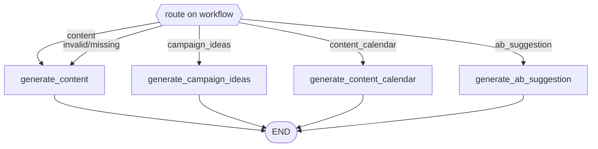

# Marketing Agent — v1 Documentation

## 1. Overview

The Marketing Agent is a LangGraph-based agent that generates marketing content, brainstorms campaign ideas, plans content calendars, and drafts A/B test variants — four distinct jobs selected by a `workflow` field on the request, rather than a fixed conversational sequence.

- **Content generation** — writes a single piece of platform- and tone-aware content.
- **Campaign ideas** — brainstorms 3 distinct campaign concepts around a goal, each with a genuinely different angle.
- **Content calendar** — spreads content ideas across a time period, varying platform and format day to day.
- **A/B suggestion** — generates two meaningfully different content variants plus a rationale for what's being tested.

It is exposed as a single FastAPI endpoint, `POST /marketing/generate`, matching the pattern used by the other agents in this repo.

The agent's underlying LLM calls use Groq (`llama-3.3-70b-versatile`) via the same shared `get_llm()` client (`backend/app/core/llm_client.py`) used by every other agent.

## 2. Architecture
FastAPI app (backend/app/main.py)
|
+- app.include_router(marketing_router)
|
backend/app/api/marketing.py <- HTTP boundary: request validation,
| graph invocation, error handling
|
backend/app/schemas/marketing.py <- Pydantic request/response contracts
|
backend/app/agents/marketing_agent/
+- graph.py <- StateGraph wiring (conditional entry point)
+- nodes.py <- Node functions (one per workflow)
+- state.py <- MarketingContentState (TypedDict)
+- prompts.py <- LLM prompt templates
|
backend/app/core/
+- state.py <- AgentState (base fields shared by all agents)
+- llm_client.py <- get_llm() factory (Groq client)

**Design principles:**

- **Conditional entry point, not a linear sequence** — following the same pattern as the HR Agent's onboarding/leave_request split, a `workflow` field picks which single node runs; the four workflows don't chain into each other.
- **Safe fallback on invalid input.** An invalid or missing `workflow` value falls back to `content` generation rather than crashing (see Known Limitations — this was a real bug found and fixed during graph finalization).
- **Isolated per-agent state** — `MarketingContentState` extends the shared `AgentState`; no Sales/HR/Support fields appear in its output.

## 3. Workflow Explanation

Each request specifies exactly one `workflow`:

- **`content`** -> `generate_content_node` writes one piece of content for the given topic, platform, and tone.
- **`campaign_ideas`** -> `generate_campaign_ideas_node` returns exactly 3 ideas for a given goal, each using a different angle (urgency, social proof, storytelling, etc.) so they're genuinely distinct.
- **`content_calendar`** -> `generate_content_calendar_node` returns a list of `{day, platform, idea}` entries spread across the given period, varying content type and platform across days.
- **`ab_suggestion`** -> `generate_ab_suggestion_node` returns two distinct content variants (different hooks/angles) plus a rationale explaining what's being tested.

Any unrecognized or missing `workflow` value falls back to `content` generation rather than erroring.

## 4. Graph Structure

`build_marketing_graph()` in `backend/app/agents/marketing_agent/graph.py` compiles the following `StateGraph`:



`_route_by_workflow(state)` validates `state["workflow"]` against the known set of four workflows; anything outside that set (typo, `None`, empty string) resolves to `"content"`.

## 5. API Endpoints

| Method | Path | Description |
|---|---|---|
| `POST` | `/marketing/generate` | Run one request through the Marketing Agent graph |

### `POST /marketing/generate`

**Request body** (`MarketingAgentRequest`):

```json
{
  "workflow": "content | campaign_ideas | content_calendar | ab_suggestion",
  "content_topic": "string, optional",
  "platform": "string, optional",
  "tone": "string, optional",
  "campaign_goal": "string, optional",
  "calendar_period": "string, optional"
}
```

**Response body** (`MarketingAgentResponse`, HTTP 200):

```json
{
  "generated_content": "string | null",
  "campaign_ideas": "string[] | null",
  "content_calendar": "object[] | null",
  "ab_variant_a": "string | null",
  "ab_variant_b": "string | null",
  "ab_rationale": "string | null"
}
```

Only the field(s) matching the requested workflow are populated; the rest are `null`.

**Error responses:**

| Status | Cause |
|---|---|
| `500 Internal Server Error` | The graph raised an exception (logged server-side via `logger.exception`) |

## 6. Example Requests

**Content generation:**
```bash
curl -X POST http://127.0.0.1:8000/marketing/generate \
  -H "Content-Type: application/json" \
  -d '{"workflow": "content", "content_topic": "new product launch", "platform": "instagram", "tone": "friendly"}'
```

**Campaign ideas:**
```bash
curl -X POST http://127.0.0.1:8000/marketing/generate \
  -H "Content-Type: application/json" \
  -d '{"workflow": "campaign_ideas", "campaign_goal": "increase signups", "content_topic": "new mobile app"}'
```

**Content calendar:**
```bash
curl -X POST http://127.0.0.1:8000/marketing/generate \
  -H "Content-Type: application/json" \
  -d '{"workflow": "content_calendar", "content_topic": "product launch", "calendar_period": "1 week"}'
```

**A/B suggestion:**
```bash
curl -X POST http://127.0.0.1:8000/marketing/generate \
  -H "Content-Type: application/json" \
  -d '{"workflow": "ab_suggestion", "content_topic": "flash sale", "platform": "email", "tone": "urgent"}'
```

## 7. Testing Instructions

```bash
# Marketing Agent integration suite (6 tests)
python -m pytest backend/tests/agents/test_marketing_agent.py -v

# Cross-agent isolation (Sales/Marketing vs HR/Support domains)
python -m pytest test_cross_agent_routing_sales_marketing.py -v
```

| Test | Focus |
|---|---|
| `test_content_workflow_generates_content` | `content` workflow populates only `generated_content` |
| `test_campaign_ideas_workflow_generates_three_ideas` | `campaign_ideas` returns exactly 3 distinct ideas |
| `test_content_calendar_workflow_generates_entries` | `content_calendar` returns a non-empty spread |
| `test_ab_suggestion_workflow_generates_two_variants` | Variants are non-identical, rationale present |
| `test_invalid_workflow_falls_back_safely` | Regression test for the typo/crash bug (see below) |
| `test_missing_workflow_falls_back_to_content` | `workflow: None` falls back correctly |

Requires `GROQ_API_KEY` set in `.env`.

## 8. Known Limitations

- **Fixed this round:** an invalid/mistyped `workflow` value (e.g. `"campaing_ideas"`) previously crashed the graph with a `KeyError` instead of failing gracefully. Fixed by validating the value in `_route_by_workflow` and falling back to `content`; covered by two regression tests.
- **Sensitive-topic handling relies on model judgment, not explicit instruction.** Testing (layoffs, restructuring topics) showed appropriately measured output, but the prompt has no explicit instruction for this — not guaranteed to hold across all topics or if the underlying model changes.
- **No human-review step.** All output is a draft/suggestion; nothing is auto-published.
- **A/B suggestion node doesn't track results** — it only generates variants, not performance data.
- **n8n workflow is minimal.** The self-hosted n8n Marketing workflow (Webhook -> Groq -> response) only covers content generation, not the other three workflows.
- **`requirements.txt` gap** — same as noted in `HR_AGENT.md` and `SALES_AGENT.md`.

## 9. Future Improvements

- Explicit sensitive-topic handling instruction in `CONTENT_GENERATION_PROMPT`.
- Extend the n8n workflow to cover all four workflow types.
- Human-review/approval step before content is considered final.
- Performance tracking for A/B suggestions.