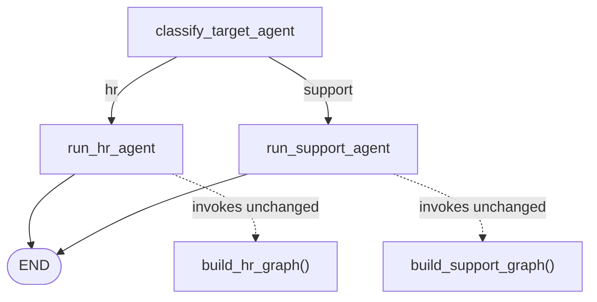

# Orchestrator — Integration Documentation

## 1. Overview

The Orchestrator is a top-level LangGraph that gives callers a single entry
point, `POST /agent/message`, for messages that could belong to either the
[HR Agent](HR_AGENT.md) or the [Support Agent](SUPPORT_AGENT.md) — without
the caller having to know in advance which one applies. It classifies the
message and dispatches to whichever agent's existing compiled graph should
handle it.

Before this integration, `/hr/message` and `/support/message` already
existed as two independent FastAPI routers, each wrapping its own graph
(`build_hr_graph()`, `build_support_graph()`) and registered on the shared
app in `backend/app/main.py`. There was no code path that picked between
them — a client had to already know which agent a message belonged to. The
Orchestrator closes that gap.

**Integration principles carried through the implementation** (matching
`HR_AGENT.md` §2 / `SUPPORT_AGENT.md` §2's own stated principles):

- **Reuse, don't duplicate** — `build_hr_graph()` and `build_support_graph()`
  are imported and invoked exactly as they already exist. No HR or Support
  node, prompt, state field, or graph edge was modified.
- **Same HTTP boundary conventions as the sibling routers** — build the
  compiled graph once at import time, validate via Pydantic before the graph
  ever runs, translate internal failures into a clean `500` with a `detail`
  field instead of a raw traceback.
- **Response schemas wrap, not duplicate** — `OrchestratorResponse` embeds
  the existing `HRAgentResponse` / `SupportAgentResponse` schemas by
  reference rather than re-declaring their fields.

## 2. Files Modified

| File | Status | Purpose |
|---|---|---|
| `backend/app/core/orchestrator.py` | New | The orchestration `StateGraph`: classifies HR vs. Support, then invokes the matching existing agent graph. |
| `backend/app/schemas/orchestrator.py` | New | `OrchestratorRequest` / `OrchestratorResponse` Pydantic contracts for `POST /agent/message`. |
| `backend/app/api/orchestrator.py` | New | The FastAPI router: builds the orchestrator graph once, exposes `POST /agent/message`. |
| `backend/app/main.py` | Modified | Registers the new router on the shared FastAPI app (2 lines added). |
| `test_orchestrator_routing.py` | New | Graph-level and API-level integration tests for the router (see §6). |

No file belonging to `backend/app/agents/hr_agent/`, `backend/app/agents/support_agent/`, `backend/app/api/hr.py`, `backend/app/api/support.py`, or either agent's schema was touched.

## 3. Purpose of Each Modification

### `backend/app/core/orchestrator.py`

The orchestration layer itself. Defines:

- `OrchestratorState` — a `TypedDict` extending the shared `AgentState`
  (same pattern as `HRAgentState` / `SupportAgentState`), adding
  `target_agent`, `hr_result`, and `support_result`.
- `classify_target_agent_node` — the entry node. One LLM call decides `"hr"`
  or `"support"`; empty input, an LLM failure, or an unrecognized reply all
  default to `"support"` (documented rationale in §5).
- `run_hr_agent_node` / `run_support_agent_node` — thin nodes that build a
  fresh `HRAgentState` / `SupportAgentState` and call
  `_hr_graph.invoke(...)` / `_support_graph.invoke(...)`, storing the result
  verbatim. Neither agent's internal fields are inspected or transformed
  here.
- `build_orchestrator_graph()` — wires the above into a compiled
  `StateGraph`, mirroring the `classify → conditional_edges` shape already
  used by `hr_agent/graph.py` and `support_agent/graph.py`.

This file was necessary because no code in the repository previously chose
between agents; it had to be added, not extended, since the choice doesn't
belong inside either agent's own graph.

### `backend/app/schemas/orchestrator.py`

Defines the external HTTP contract: `OrchestratorRequest` (mirrors
`HRAgentRequest` / `SupportAgentRequest`) and `OrchestratorResponse`, which
carries `agent: Literal["hr", "support"]` plus optional `hr` /
`support` fields typed as the *existing* `HRAgentResponse` /
`SupportAgentResponse`. Necessary so the new endpoint has a typed,
documented response shape without re-declaring either agent's field list.

### `backend/app/api/orchestrator.py`

The HTTP boundary. Builds `_orchestrator_graph` once at import time (same
reasoning as `_hr_graph` / `_support_graph` in the sibling routers —
compiled LangGraph graphs are stateless and safe to reuse across requests),
then on each request invokes it, reads `target_agent` off the result, and
constructs the matching response model. Necessary as the piece that turns
the graph into a callable endpoint; see §7–§8 for a defect found and fixed
in this file's original version.

### `backend/app/main.py`

```diff
 from backend.app.api.auth import router as auth_router
 from backend.app.api.hr import router as hr_router
+from backend.app.api.orchestrator import router as orchestrator_router
 from backend.app.api.support import router as support_router
 ...
 app.include_router(auth_router)
 app.include_router(hr_router)
 app.include_router(support_router)
+app.include_router(orchestrator_router)
```

Necessary to actually expose the new router — every other router in the app
is registered the same way, so this was a 2-line addition, not a
restructuring.

### `test_orchestrator_routing.py`

Necessary to prove the four files above actually route correctly, pass
state correctly, and fail gracefully — see §6.

## 4. Integration Flow

A single `POST /agent/message` request flows through the system as follows:

1. **Pydantic validation** — `OrchestratorRequest` rejects empty/missing/
   wrong-type `user_input` or a malformed body before anything else runs
   (`422`, no graph invocation).
2. **`classify_target_agent_node`** — one LLM call reads `user_input` and
   decides `target_agent = "hr"` or `"support"`.
3. **Conditional edge** — `_route_by_target_agent` reads `target_agent` and
   routes to `run_hr_agent` or `run_support_agent`.
4. **Delegation, unchanged** — the chosen node builds a fresh
   `HRAgentState`/`SupportAgentState` (same shape `/hr/message` and
   `/support/message` build for their own requests) and calls that agent's
   own compiled graph via `.invoke()`. From this point on, execution is
   entirely the existing HR or Support graph — classification, extraction,
   RAG retrieval, decisioning, and response drafting all happen exactly as
   documented in `HR_AGENT.md` / `SUPPORT_AGENT.md`, with zero orchestrator
   involvement.
5. **Result capture** — the sub-graph's full final state is stored back on
   `hr_result` or `support_result`.
6. **Response assembly** — `api/orchestrator.py` reads whichever result was
   populated, defensively pulls each field via `.get(key, default)` (§7),
   and returns an `OrchestratorResponse` wrapping the corresponding
   `HRAgentResponse` or `SupportAgentResponse`.
7. **Error translation** — a graph exception, or a completed run with no
   `agent_response`, becomes a `500` with a `detail` field, logged
   server-side — never a raw traceback.

## 5. Router Architecture

```
FastAPI app (backend/app/main.py)
    │
    ├─ app.include_router(hr_router)          <- unchanged
    ├─ app.include_router(support_router)      <- unchanged
    ├─ app.include_router(orchestrator_router) <- new
    │
backend/app/api/orchestrator.py       <- HTTP boundary: request validation,
    │                                     graph invocation, error handling
    │
backend/app/schemas/orchestrator.py   <- OrchestratorRequest / OrchestratorResponse
    │                                     (wraps HRAgentResponse / SupportAgentResponse)
    │
backend/app/core/orchestrator.py      <- StateGraph: classify -> dispatch
    │
    ├──────────────────────┬──────────────────────┐
    ▼                      ▼                      │
build_hr_graph()      build_support_graph()        │
(agents/hr_agent/      (agents/support_agent/       │
 graph.py, unchanged)   graph.py, unchanged)  ──────┘
```

The Orchestrator sits **above** the two existing agent routers as a third,
independent entry point — it does not replace or wrap `/hr/message` or
`/support/message`, both of which continue to work unchanged for callers
that already know which agent they need.

Graph structure of `build_orchestrator_graph()`:



`_route_by_target_agent(state)` is the single conditional-edge selector; it
reads `state["target_agent"]` and defaults to `"support"`, the same
never-dead-end pattern as `_route_by_workflow` in both sibling graphs.

## 6. Testing Performed

All tests are deterministic and require no network access or
`GROQ_API_KEY` — the orchestrator's routing LLM call is stubbed via
`unittest.mock.patch` on `backend.app.core.orchestrator.get_llm`, and each
sub-graph's own LLM calls are stubbed the same way
`test_cross_agent_routing.py` already does it (`hr_nodes.get_llm` /
`support_nodes.get_llm`), reusing that file's `HRFakeLLM` / `SupportFakeLLM`
pattern rather than inventing a new one.

```bash
python -m pytest test_orchestrator_routing.py -v
```

| Test class | Focus | Count |
|---|---|---|
| `OrchestratorGraphRoutingTests` | `build_orchestrator_graph()` invoked directly (no HTTP): onboarding → `hr`, password reset → `support` | 2 tests |
| `AgentMessageEndpointHappyPathTests` | `POST /agent/message`: HR onboarding, HR leave request, Support password reset, Support refund, and unrecognized input (defaults to `support`, lands on `workflow="unknown"`) | 5 tests |
| `AgentMessageEndpointInvalidInputTests` | Empty `user_input`, missing field, wrong type, non-JSON body — all `422` before the graph runs | 4 tests |
| `AgentMessageEndpointErrorHandlingTests` | Graph-invocation exception → `500`; empty `agent_response` → `500`; a result missing the `workflow` key degrades to `"unknown"` rather than crashing (regression test for the bug in §7) | 3 tests |

**Total: 14 tests, all passing.**

A full regression run confirms no HR, Support, or cross-agent behavior was
affected:

```bash
python -m pytest test_hr_agent.py test_hr_agent_api.py test_hr_agent_comprehensive.py \
    test_hr_agent_extraction.py test_hr_agent_graph.py test_hr_agent_nodes.py \
    test_support_agent_api.py test_support_agent_comprehensive.py test_support_agent_graph.py \
    test_support_agent_nodes.py test_support_agent_resilience.py test_support_agent_sample_tickets.py \
    test_cross_agent_routing.py test_orchestrator_routing.py -q
```

```
194 passed, 3 warnings, 53 subtests passed
```

(180 pre-existing tests + 14 new orchestrator tests; the 3 warnings are the
repo's pre-existing `on_event`/`httpx` deprecation notices, unrelated to
this work — see `HR_AGENT.md` §11.)

## 7. Bugs Found

**Response construction did not match the sibling endpoints' defensive
pattern.** The first version of `api/orchestrator.py` built response models
with a blind dict-spread:

```python
return OrchestratorResponse(agent="hr", hr=HRAgentResponse(**hr_state))
```

`api/hr.py` and `api/support.py`, by contrast, build every field explicitly
with `.get(key, default)`, e.g. `workflow=final_state.get("workflow",
"unknown")`. The spread form was safe *today* only because every branch of
both agent graphs happens to set `workflow` and `agent_response` before
`END`. If either graph ever grew a branch that didn't set one of those
fields, the sibling endpoints would degrade gracefully (default value, still
`200`), while `api/orchestrator.py` would instead raise an unhandled
`pydantic.ValidationError` — surfacing as a raw `500` with no `detail`,
unlike every other error path in this router. This was a real inconsistency
in response-format/error-handling robustness relative to the established
project convention, found during the routing/state/graph/response/
error-handling audit requested for this integration.

## 8. Fixes Applied

`api/orchestrator.py` was changed to build both `HRAgentResponse` and
`SupportAgentResponse` field-by-field with `.get(key, default)`, using the
exact field lists already defined in `api/hr.py` and `api/support.py`:

```python
return OrchestratorResponse(
    agent="hr",
    hr=HRAgentResponse(
        agent_response=agent_response,
        workflow=hr_state.get("workflow", "unknown"),
        employee_name=hr_state.get("employee_name"),
        ...
    ),
)
```

A regression test,
`AgentMessageEndpointErrorHandlingTests::test_hr_result_missing_workflow_key_degrades_to_unknown_instead_of_500`,
was added to `test_orchestrator_routing.py`: it stubs the orchestrator graph
to return an `hr_result` with no `workflow` key and asserts the endpoint
still returns `200` with `workflow: "unknown"`, instead of a `500`. This
test fails against the original spread-based implementation and passes
against the fix, confirming the fix actually closes the gap rather than
just changing style.

## 9. Final Outcome

- **Routing** — verified correct: HR-domain and Support-domain messages
  each dispatch to the right agent graph, with a documented, tested default
  (`"support"`) for ambiguous or unclassifiable input.
- **State passing** — verified correct: each sub-graph receives a fresh,
  correctly-shaped initial state; `hr_result`/`support_result` are mutually
  exclusive per invocation.
- **Graph execution** — verified correct: `build_orchestrator_graph()`
  compiles and routes via conditional edges exactly as designed, invoking
  either existing agent graph unmodified.
- **Response format** — one real gap found and fixed (§7–§8); the endpoint
  now matches `/hr/message` and `/support/message`'s defensive
  field-construction pattern exactly.
- **Error handling** — verified correct end to end: `422` for invalid
  payloads before the graph runs, `500` with a logged `detail` for graph
  failures or incomplete results, no raw tracebacks.

**HR and Support agents work correctly through the new `/agent/message`
router**, with zero changes to either agent's graph, nodes, state, or
prompts. 5 files touched in total (4 new, 1 two-line addition to
`main.py`); 14 new tests added; 194/194 tests pass across the full HR +
Support + cross-agent + orchestrator suite.

## 10. Related Documentation

- [HR_AGENT.md](HR_AGENT.md) — HR Agent architecture, workflows, API, testing
- [SUPPORT_AGENT.md](SUPPORT_AGENT.md) — Support Agent architecture, workflows, API, testing
- `test_cross_agent_routing.py` — the pre-existing test file this integration's `RouteFakeLLM`/`HRFakeLLM`/`SupportFakeLLM` pattern is kept in sync with
