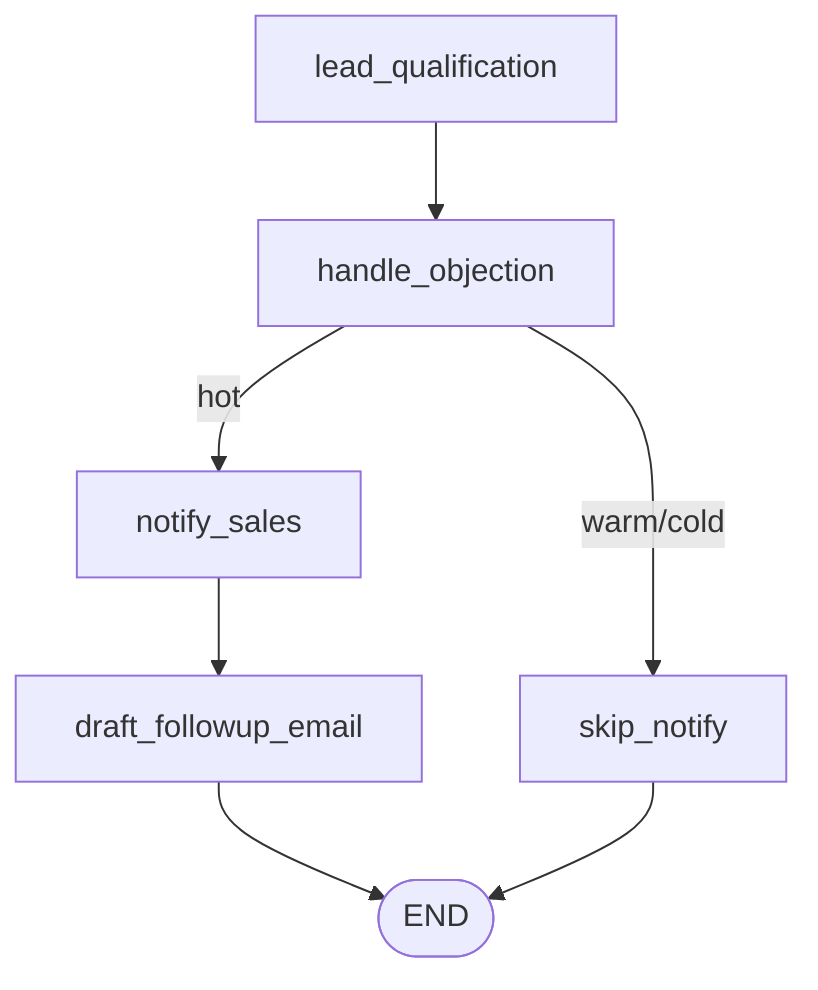

# Sales Agent — v1 Documentation

## 1. Overview

The Sales Agent is a LangGraph-based conversational agent that automates
lead qualification and follow-up from a single free-text message:

- **Lead qualification** — classifies a lead's interest as Hot, Warm, or
  Cold and drafts a personalized reply.
- **Objection handling** — detects sales objections (price, competitor,
  timing) and drafts a respectful, non-pushy response, run for every lead
  regardless of qualification outcome.
- **Sales notification + follow-up email** — hot leads are flagged for the
  sales team and get a personalized follow-up email that references any
  objection raised; warm/cold leads are logged without an alert.

It is exposed as a single FastAPI endpoint, `POST /sales/message`, matching
the pattern used by HR and Support.

The agent's LLM calls use Groq (`llama-3.3-70b-versatile`) via
`langchain_groq.ChatGroq`, configured once in `backend/app/core/llm_client.py`.

## 2. Architecture

FastAPI app (backend/app/main.py)
│
├─ app.include_router(sales_router)
│
backend/app/api/sales.py <- HTTP boundary
│
backend/app/schemas/sales.py <- Pydantic request/response contracts
│
backend/app/agents/sales_agent/
├─ graph.py <- StateGraph wiring
├─ nodes.py <- Node functions
├─ state.py <- SalesLeadState (TypedDict)
└─ prompts.py <- LLM prompt templates


## 3. Workflow Explanation

1. A message like *"I'm interested in your pricing, want to sign up this
   week"* arrives.
2. `lead_qualification_node` classifies intent (hot/warm/cold) and drafts a
   reply.
3. `handle_objection_node` runs next for every lead, detecting any sales
   objection and drafting a response to it.
4. Routing: hot leads → `notify_sales_node` → `draft_followup_email_node`
   (which references the objection response if one was raised) → END.
   Warm/cold leads → `skip_notify_node` → END.

## 4. Graph Structure



`_route_by_qualification(state)` reads `state["intent"]`; anything other
than `"hot"` routes to the unqualified branch.

## 5. API Endpoints

| Method | Path | Description |
|---|---|---|
| `POST` | `/sales/message` | Run one lead message through the Sales Agent graph |

**Request body** (`SalesAgentRequest`):
```json
{
  "user_input": "string, required",
  "lead_name": "string, optional"
}
```

**Response body** (`SalesAgentResponse`, HTTP 200):
```json
{
  "agent_response": "string",
  "intent": "hot | warm | cold",
  "notified": true,
  "followup_email_subject": "string | null",
  "followup_email_body": "string | null",
  "has_objection": true,
  "objection_response": "string"
}
```

## 6. Example Request/Response

```bash
curl -X POST http://127.0.0.1:8000/sales/message \
  -H "Content-Type: application/json" \
  -d '{"user_input": "We want to sign up this week, but honestly the price is higher than competitors", "lead_name": "Noor"}'
```
```json
{
  "agent_response": "[HOT LEAD - sales team notified] Hi Noor, thank you...",
  "intent": "hot",
  "notified": true,
  "followup_email_subject": "Next Steps on Enterprise Plan Discussion",
  "followup_email_body": "Hi Noor, I wanted to follow up... address your concerns about the price...",
  "has_objection": true,
  "objection_response": "Hi Noor, I completely understand your concern about the pricing..."
}
```

## 7. Testing Instructions

```bash
python -m pytest backend/tests/agents/test_sales_agent.py -v
python -m pytest test_cross_agent_routing_sales_marketing.py -v
```

6 integration tests cover: hot classification + notification + follow-up
email, cold/no-email, crash-safety on vague/empty input, follow-up gating,
and objection detection.

## 8. n8n Workflow

`n8n-workflows/sales-agent-workflow.json` — Webhook → Groq (HTTP Request,
`llama-3.3-70b-versatile`) → conditional branch → response. Runs on a
self-hosted n8n instance (Docker) after the n8n cloud trial expired.

## 9. Known Limitations

- Notification is a placeholder text prefix, not a real Slack/email alert
  to the sales team.
- Objection detection is broader than a strict sales definition — mild
  hesitation (e.g. "just browsing") is flagged the same as a hard price
  objection.
- Google Sheets CRM logging on the self-hosted n8n instance is currently
  blocked: a Service Account credential is configured and selectable, but
  the node reports "no credentials set". Nodes removed from the workflow
  pending further debugging or a switch to a dedicated CRM.
- CRM matching (when working) uses lead Name, not a unique identifier.

## 10. Future Improvements

- Real Slack/email notification integration.
- Real CRM (HubSpot) instead of Google Sheets.
- Narrow objection detection to exclude mild hesitation.
- Revisit whether an objection combined with clear buying intent should
  push classification further toward "hot" in more ambiguous cases.