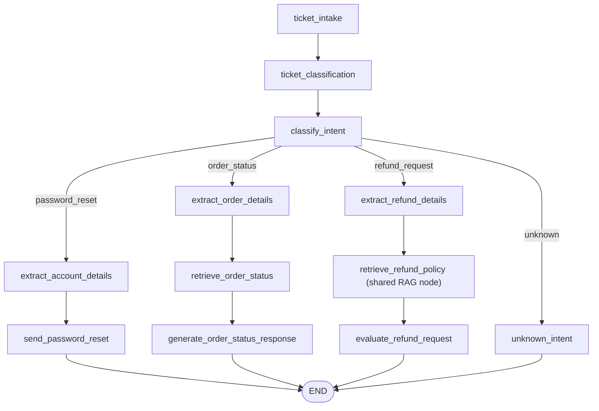

# Support Agent — v1 Documentation

## 1. Overview

The Support Agent is a LangGraph-based conversational agent that automates
customer support intake and triage from a single free-text message:

- **Ticket intake** — every request immediately gets a ticket record (ID,
  status, priority, category placeholder), regardless of what it turns out
  to be about.
- **Ticket classification** — the ticket is classified into one of 7
  business/reporting categories with a confidence score, independent of
  which automated workflow (if any) ends up handling it.
- **Intent routing** — an LLM-based classifier decides whether the request
  is a **password reset**, **order status** check, or **refund request**,
  and routes to the matching workflow; anything else falls back to a
  clarification message.
- **Refund policy grounding** — the refund-request workflow retrieves
  relevant policy context from the company's real document store via the
  shared RAG (Retrieval-Augmented Generation) pipeline, instead of relying
  on the LLM's general knowledge.

Like the HR Agent, the Support Agent is exposed over HTTP via a single
FastAPI endpoint, `POST /support/message` (`backend/app/api/support.py`,
registered in `backend/app/main.py`), so any client can drive it without
depending on LangGraph directly. It can also still be invoked directly by
building the compiled graph and calling `.invoke()`, exactly as the test
suite does (see [API Endpoints & Example Requests](#10-api-endpoints--example-requests)).

The agent's underlying LLM calls use Groq (`llama-3.3-70b-versatile`) via
`langchain_groq.ChatGroq`, configured once in
`backend/app/core/llm_client.py` — the same factory every agent in this repo
shares. Every node that calls the LLM degrades to a deterministic fallback
response if the call fails (mirroring the HR Agent's `_invoke_llm()`), so a
Groq outage never crashes the graph.

## 2. Architecture

The Support Agent is built on the same shared scaffold as every other agent
in this repo (see `backend/app/agents/hr_agent/` for the sibling
implementation), and reuses the shared RAG infrastructure rather than
maintaining its own:

```
FastAPI app (backend/app/main.py)
    │
    ├─ app.include_router(support_router)
    │
backend/app/api/support.py       <- HTTP boundary: request validation,
    │                                graph invocation, error handling
    │
backend/app/schemas/support.py   <- Pydantic request/response contracts
    │
backend/app/agents/support_agent/
    ├─ graph.py                  <- StateGraph wiring (nodes + conditional edges)
    ├─ nodes.py                  <- Node functions (business logic)
    ├─ state.py                  <- SupportAgentState (TypedDict)
    ├─ rag.py                    <- Order-status lookup (a transactional
    │                               lookup, not a RAG concern)
    └─ prompts.py                <- LLM prompt templates
    │
backend/app/core/
    ├─ state.py                  <- AgentState (base fields shared by all agents)
    ├─ graph.py                  <- Minimal single-node scaffold graph (not used directly)
    ├─ llm_client.py              <- get_llm() factory (Groq client)
    ├─ embeddings.py               <- BAAI/bge-m3 embedding model (sentence-transformers)
    ├─ retrieval.py                 <- pgvector cosine-distance document retrieval
    └─ rag_node.py                  <- rag_retrieval_node, the shared LangGraph RAG step
```

**Design principles carried through the implementation:**

- **Reuse the shared RAG pipeline, don't duplicate it** — refund-policy
  retrieval delegates to `core/rag_node.py`'s `rag_retrieval_node` (real
  pgvector semantic search), wrapped in try/except for graceful
  degradation. There is no agent-local keyword-matching retrieval anymore.
- **Ticket classification is independent of workflow routing** —
  `ticket_category`/`ticket_category_confidence` (business/reporting data)
  and `workflow` (which graph branch runs) are set by two separate nodes
  and never influence each other. Only 3 of the 7 ticket categories
  currently have a dedicated workflow branch; see [Supported Ticket
  Categories](#8-supported-ticket-categories).
- **Isolated per-agent state** — `SupportAgentState` extends the shared
  `AgentState` rather than modifying it, so the HR Agent and any future
  agent are unaffected by support-specific fields.
- **Graceful degradation** — a RAG retrieval failure (network, DB,
  embedding model) is caught and logged rather than crashing the graph; a
  malformed or low-confidence ticket-classification response, or a failure
  to obtain an LLM client at all (e.g. a missing/invalid `GROQ_API_KEY`),
  degrades `ticket_classification_node` to `"Unknown"` rather than
  propagating bad data or crashing the graph. Every LLM-calling node
  (intent classification, password reset, order status, refund) is wrapped
  by a shared `_invoke_llm()` helper (mirroring `hr_agent.nodes._invoke_llm`)
  that returns a deterministic fallback string on any LLM failure instead of
  letting the exception crash the graph invocation; `ticket_classification_node`
  has its own equivalent try/except (its JSON-classification response shape
  doesn't fit `_invoke_llm`'s plain-string return), covering LLM-client
  construction failures the same way, not just `.invoke()`/parsing failures.
- **Partial-state-update node contract** — every node returns only the keys
  it changes; LangGraph merges updates into the running state. This was
  unified across all nodes (some previously mutated and returned the full
  state dict, matching neither `hr_agent`'s convention nor each other) as
  part of adding the LLM-failure resilience above.

## 3. Workflow Description & LangGraph Flow

### Password Reset

1. A message like *"I forgot my password and can't log in"* arrives.
2. `ticket_intake` opens a ticket; `ticket_classification` tags it (e.g.
   `Password Reset`) independently of routing.
3. The intent classifier recognizes it as `password_reset`.
4. `account_email` is set to `"Unknown"` unless already supplied on the
   state (placeholder extraction -- see [Known Limitations](#13-known-limitations)).
5. An LLM-generated confirmation is produced acknowledging the reset link
   was sent, with a deterministic fallback if the LLM call fails.

### Order Status

1. A message like *"Where is my order ORD-12345?"* arrives.
2. The intent classifier recognizes it as `order_status`.
3. `order_id` is set to `"Unspecified"` unless already supplied (same
   placeholder caveat as password reset).
4. `lookup_order_status` returns a fixed placeholder status (no real
   order-management system is wired up yet).
5. An LLM-generated response summarizes the status, referencing the order
   ID mentioned in the original message even though the structured field
   stays a placeholder.

### Refund Request

1. A message like *"I want a refund for order ORD-777, it arrived broken"*
   arrives.
2. The intent classifier recognizes it as `refund_request` -- ONLY when the
   customer is asking for a refund on their own purchase, not asking a
   general policy question (see below).
3. `order_id` and `refund_reason` default to `"Unspecified"` unless already
   supplied.
4. Relevant refund-policy context is retrieved from the real document store
   via the shared RAG pipeline (see [RAG Integration](#7-rag-integration)).
5. The agent never auto-approves or denies the refund -- it always sets
   `refund_decision="pending_manual_review"` and drafts a response
   acknowledging the request, grounded in the retrieved policy context.

### Unknown / Fallback

Any message that doesn't match a supported workflow (or carries no usable
input) returns a fixed clarification message listing what the agent can
currently help with, with no LLM call.

This deliberately includes messages that *mention* refunds/orders but
aren't an actual new request -- general policy questions ("what's your
return policy?"), billing disputes, and status checks on an
already-submitted request. `evaluate_refund_request_node` only knows how to
acknowledge a **new** refund request; earlier testing found that
classifying policy questions as `refund_request` anyway silently created a
phantom ticket with `refund_decision="pending_manual_review"` for a refund
nobody asked for. `CLASSIFY_INTENT_PROMPT` now explicitly routes them to
`unknown` instead -- see [Known Limitations](#13-known-limitations). Note
that `ticket_category` (business/reporting classification) is independent
of `workflow` (routing) -- a policy question can still land on
`ticket_category="Refund"` for reporting purposes while `workflow` stays
`unknown`; see [Ticket Classification](#6-ticket-classification).

### LangGraph Flow

`build_support_graph()` in `backend/app/agents/support_agent/graph.py`
compiles the following flow:

1. **`ticket_intake`** (entry point) — opens a ticket record unconditionally.
2. **`ticket_classification`** — classifies the ticket into a business
   category with a confidence score. Runs before routing, so it never
   affects which branch is taken.
3. **`classify_intent`** — a single LLM call decides `workflow`:
   `password_reset`, `order_status`, `refund_request`, or `unknown`. A
   conditional edge routes to the matching branch:
   - **`password_reset`** → `extract_account_details` → `send_password_reset` → END
   - **`order_status`** → `extract_order_details` → `retrieve_order_status` → `generate_order_status_response` → END
   - **`refund_request`** → `extract_refund_details` → `retrieve_refund_policy` (real RAG) → `evaluate_refund_request` → END
   - **`unknown`** → `unknown_intent` → END (fixed clarification message, no LLM call)

Every path — including the unknown fallback — ends with a populated
`ticket_id`, `ticket_category`, `workflow`, and `agent_response`.

`refund_request` requires the customer to be actively asking for a refund
on their own purchase -- a general policy question ("what's your return
policy?") does not qualify and is classified `unknown` instead, even though
it mentions refunds/returns. Earlier testing found the looser prompt
wording caused policy questions to be misrouted into `refund_request`,
silently creating a phantom ticket with `refund_decision="pending_manual_review"`
for a refund nobody asked for; see [Known Limitations](#13-known-limitations).

## 4. Graph Diagram



`_route_by_workflow(state)` — the single conditional-edge selector — reads
`state["workflow"]` as set by `classify_intent_node`, defaulting to
`"unknown"` so an unrecognized future value can never dead-end the graph.

## 5. Nodes

| Node | Phase | Description |
|---|---|---|
| `ticket_intake_node` | Entry | Deterministic (no LLM): assigns `ticket_id`, `ticket_status="Open"`, a keyword-heuristic `ticket_priority`, and a placeholder `issue_category`. Only fills fields not already set. |
| `ticket_classification_node` | Entry | LLM call: classifies into one of 7 categories + confidence; gates low-confidence/unrecognized results to `"Unknown"`. See [Ticket Classification](#6-ticket-classification). |
| `classify_intent_node` | Entry | LLM call: single-word `workflow` classification (`password_reset` / `order_status` / `refund_request` / `unknown`). Drives the conditional edge. |
| `extract_account_details_node` | Password Reset | Placeholder extraction of `account_email` (defaults to `"Unknown"`). |
| `send_password_reset_node` | Password Reset | Marks `reset_link_sent=True` and drafts a confirmation message via LLM. No real auth system wired up. |
| `extract_order_details_node` | Order Status | Placeholder extraction of `order_id` (defaults to `"Unspecified"`). |
| `retrieve_order_status_node` | Order Status | Calls `rag.py`'s `lookup_order_status` — a fixed placeholder status, not a real order-management call. |
| `generate_order_status_response_node` | Order Status | Drafts a response summarizing order status via LLM. |
| `extract_refund_details_node` | Refund Request | Placeholder extraction of `order_id` and `refund_reason`. |
| `retrieve_refund_policy_node` | Refund Request | Delegates to the shared `rag_retrieval_node` for real pgvector-backed policy retrieval; try/except for graceful degradation. See [RAG Integration](#7-rag-integration). |
| `evaluate_refund_request_node` | Refund Request | Always sets `refund_decision="pending_manual_review"` (never auto-approves/denies) and drafts a response via LLM, using retrieved policy context. |
| `unknown_intent_node` | Fallback | Fixed clarification message, no LLM call. |

## 6. Ticket Classification

`ticket_classification_node` (in `nodes.py`) assigns each ticket a
business/reporting category, separate from workflow routing:

- **Prompt contract** (`TICKET_CLASSIFICATION_PROMPT` in `prompts.py`) asks
  the LLM to respond with strict JSON: `{"category": "...", "confidence":
  <0.0-1.0>}` — the same structured-JSON convention already used by
  `sales_agent.lead_qualification_node` and
  `marketing_agent.generate_content_node`, since `classify_intent_node`'s
  single-bare-word format can't carry a numeric confidence.
- **Category set**: `Refund`, `Password Reset`, `Billing`, `Technical
  Issue`, `Account Issue`, `Order Status`, `General Inquiry` (see
  [Supported Ticket Categories](#8-supported-ticket-categories)).
- **Confidence threshold**: `_TICKET_CATEGORY_CONFIDENCE_THRESHOLD = 0.6`
  (a new, locally-scoped constant — no project-wide threshold existed
  anywhere else in the repo). A response is downgraded to `"Unknown"` when
  either:
  - the category isn't one of the 7 recognized labels, or
  - `confidence < 0.6`.
- **Failure handling**: malformed JSON, a missing `category`/`confidence`
  key, or any LLM error is caught and defaults to `("Unknown", 0.0)` rather
  than raising.
- **Empty input short-circuit**: blank/whitespace-only `user_input` returns
  `("Unknown", 0.0)` without calling the LLM at all.

## 7. RAG Integration

Refund-policy retrieval is wired to the shared RAG pipeline — there is no
Support-Agent-specific retrieval implementation:

```
retrieve_refund_policy_node (nodes.py)
    -> rag_retrieval_node (backend/app/core/rag_node.py)
        -> retrieve_relevant_docs (backend/app/core/retrieval.py)
            -> embed_text (backend/app/core/embeddings.py, BAAI/bge-m3)
            -> dialect-aware document query over the Document table
               (pgvector `<=>` cosine-distance on Postgres; a Python
               cosine-similarity fallback on every other dialect)
        -> merges retrieved context into state["system_prompt"]
```

- The retrieved context lands on the **inherited `system_prompt` field**
  (not a dedicated Support-Agent field) — `evaluate_refund_request_node`
  reads it via `state.get("system_prompt") or ""` when drafting the final
  response.
- **Graceful degradation**: `retrieve_refund_policy_node` wraps the call in
  try/except (mirroring `hr_agent.nodes.retrieve_leave_policy_node`'s
  pattern) — a retrieval/embedding/DB failure is logged and the graph
  continues with no policy context, rather than crashing.
- **Dialect-aware retrieval**: `retrieve_relevant_docs` (in
  `core/retrieval.py`) checks `engine.dialect.name`. On **Postgres** it uses
  the real pgvector `<=>` cosine-distance operator, ordering/limiting in
  SQL — unchanged production behavior, requires the pgvector extension. On
  any other dialect (**SQLite**, used for local dev/tests) it fetches all
  rows and computes cosine similarity in Python instead, since pgvector's
  operator has no SQLite equivalent (this used to raise
  `sqlite3.OperationalError: near ">": syntax error` — see
  `test_retrieval.py`). The `sentence-transformers` package (pinned in
  `requirements.txt`) is required either way, for `embed_text`.
- **Known gap**: no refund/support-specific documents have been ingested
  yet — only HR sample policy docs exist in the vector store today (via the
  root-level `ingest_docs.py`), and `retrieve_relevant_docs` has no
  per-agent source filter, so a populated store would currently return
  documents from any domain. See [Future
  Improvements](#12-future-improvements).

## 8. Supported Ticket Categories

| Category | Description | Dedicated Workflow Branch |
|---|---|---|
| Refund | Requesting a refund, return, or money back | Yes — `refund_request` |
| Password Reset | Resetting a password, locked out of an account | Yes — `password_reset` |
| Order Status | Tracking an order, delivery status | Yes — `order_status` |
| Billing | Payment methods, charges, invoices, subscription costs | No — routes to the `unknown` clarification fallback |
| Technical Issue | Something in the product/app/website not working | No — routes to the `unknown` clarification fallback |
| Account Issue | Account settings, profile, or access problems other than password reset | No — routes to the `unknown` clarification fallback |
| General Inquiry | Anything else that doesn't fit the categories above | No — routes to the `unknown` clarification fallback |
| Unknown | Assigned when the LLM's category isn't recognized, or its confidence falls below 0.6 | No — routes to the `unknown` clarification fallback |

`ticket_category` is always populated (never null) for reporting purposes,
even when `workflow` resolves to `unknown` — see the Billing/Technical
Issue/Account Issue/General Inquiry examples in [Example
Responses](#11-example-responses).

## 9. Testing Summary

```bash
python -m pytest test_support_agent_graph.py test_support_agent_nodes.py \
    test_support_agent_sample_tickets.py test_support_agent_comprehensive.py \
    test_support_agent_api.py test_support_agent_resilience.py -v
```

| Test file | Focus | Count |
|---|---|---|
| `test_support_agent_graph.py` | End-to-end graph invocation for all 3 workflows + unknown fallback; ticket creation | 5 tests |
| `test_support_agent_nodes.py` | `ticket_intake_node` unit tests (priority heuristic, field preservation) | 13 tests |
| `test_support_agent_sample_tickets.py` | 25 realistic tickets across all 7 categories + unrelated/low-confidence requests, asserting category + workflow + response together | 4 tests, 25 subtests |
| `test_support_agent_comprehensive.py` | Graph compilation, RAG success/failure, ticket-classification unit tests (all categories, confidence boundary, malformed input, LLM-client construction failure), invalid/empty/unicode/very-long input, unknown-intent, end-to-end state shape, state isolation | 36 tests |
| `test_support_agent_api.py` | `/support/message` HTTP contract, validation, error handling (mirrors `test_hr_agent_api.py`) | 10 tests |
| `test_support_agent_resilience.py` | LLM-failure fallback for every LLM-calling node (`_invoke_llm` regression coverage, mirrors `test_hr_agent_nodes.py`'s `RaisingLLM` tests); extraction nodes' "don't overwrite an existing field" contract | 12 tests |

Plus two suites shared with the HR Agent (see `HR_AGENT.md` section 9):
`test_cross_agent_routing.py` (deterministic HR↔Support routing isolation)
and `test_live_llm_accuracy.py` (live-Groq accuracy regression, opt-in via
`GROQ_API_KEY`); and `test_retrieval.py` (11 tests) for the shared
`core/retrieval.py` dialect-routing fix that the RAG Integration section
above describes — not Support-Agent-specific code, but what
`retrieve_refund_policy_node` depends on.

All tests in this file's table are deterministic and require no network
access or `GROQ_API_KEY` — the LLM is stubbed via `unittest.mock.patch` on
`get_llm`, and the shared RAG node is stubbed via `patch.object` on
`rag_retrieval_node`, consistent with the HR Agent suite's conventions.

## 10. API Endpoints & Example Requests

| Method | Path | Description |
|---|---|---|
| `POST` | `/support/message` | Run one message through the Support Agent graph |

**Request body** (`SupportAgentRequest`):
```json
{
  "user_input": "string, required, min length 1"
}
```

```bash
# Refund request
curl -X POST http://127.0.0.1:8000/support/message \
  -H "Content-Type: application/json" \
  -d '{"user_input": "I'\''d like a refund for order #4521, it arrived broken."}'

# Password reset
curl -X POST http://127.0.0.1:8000/support/message \
  -H "Content-Type: application/json" \
  -d '{"user_input": "I forgot my password and I'\''m locked out of my account."}'

# General policy question (must NOT create a refund ticket -- see Known Limitations)
curl -X POST http://127.0.0.1:8000/support/message \
  -H "Content-Type: application/json" \
  -d '{"user_input": "Just wondering what your return policy is."}'
```

**Error responses** (identical contract to `/hr/message` -- see `HR_AGENT.md` section 5):
`422` on Pydantic validation failure (empty/missing/wrong-type `user_input`,
malformed JSON body); `500` (with a `detail` field, no raw traceback) if the
graph raises or completes with no `agent_response`.

The graph can also still be invoked directly in Python, exactly as the test
suite does:

```python
from backend.app.agents.support_agent.graph import build_support_graph

graph = build_support_graph()

# Billing (a recognized ticket category with no dedicated workflow branch)
graph.invoke({
    "messages": [],
    "user_input": "I was charged twice for my subscription this month.",
    "agent_response": None,
    "agent_name": "support_agent",
})
```

## 11. Example Responses

**Refund request** (final state, abridged):
```json
{
  "ticket_id": "TCK-4F2A9B10",
  "ticket_status": "Open",
  "ticket_category": "Refund",
  "ticket_category_confidence": 0.93,
  "workflow": "refund_request",
  "refund_decision": "pending_manual_review",
  "agent_response": "Your refund request has been submitted for manual review."
}
```

**Password reset** (final state, abridged):
```json
{
  "ticket_id": "TCK-9C13E7A2",
  "ticket_status": "Open",
  "ticket_category": "Password Reset",
  "ticket_category_confidence": 0.9,
  "workflow": "password_reset",
  "reset_link_sent": true,
  "agent_response": "A password reset link has been sent to your account email."
}
```

**Billing** (recognized category, no dedicated workflow — routes to the
clarification fallback; demonstrates that `ticket_category` and `workflow`
are independent):
```json
{
  "ticket_id": "TCK-1D77B043",
  "ticket_status": "Open",
  "ticket_category": "Billing",
  "ticket_category_confidence": 0.79,
  "workflow": "unknown",
  "agent_response": "I can currently help with password resets, order status checks, and submitting new refund requests. I'm not yet able to answer general policy questions or check the status of an existing request -- please reach out to support directly for those. Could you tell me more about what you need?"
}
```

**Off-topic / low confidence** (final state, abridged):
```json
{
  "ticket_id": "TCK-77AA0921",
  "ticket_status": "Open",
  "ticket_category": "Unknown",
  "ticket_category_confidence": 0.35,
  "workflow": "unknown",
  "agent_response": "I can currently help with password resets, order status checks, and submitting new refund requests. I'm not yet able to answer general policy questions or check the status of an existing request -- please reach out to support directly for those. Could you tell me more about what you need?"
}
```

**General policy question** (final state, abridged) — `"Just wondering what
your return policy is."` A refund/return *policy* question, not an actual
refund request. `ticket_category` may still land on `"Refund"` (it mentions
refunds, for reporting purposes that's a reasonable tag), but `workflow`
correctly stays `unknown` so no phantom pending-review refund ticket is
created for a refund nobody asked for -- this is the specific misrouting
this round of testing fixed (see [Known Limitations](#13-known-limitations)):
```json
{
  "ticket_id": "TCK-6B9F0E12",
  "ticket_status": "Open",
  "ticket_category": "Refund",
  "ticket_category_confidence": 0.85,
  "workflow": "unknown",
  "refund_decision": null,
  "agent_response": "I can currently help with password resets, order status checks, and submitting new refund requests. I'm not yet able to answer general policy questions or check the status of an existing request -- please reach out to support directly for those. Could you tell me more about what you need?"
}
```

## 12. Future Improvements

- **A dedicated policy-question / FAQ workflow** — general questions about
  refund/return policy, order-status lookups without an order ID, etc.
  currently route to `unknown` rather than being answered directly (see
  [Known Limitations](#13-known-limitations)); a read-only FAQ branch,
  grounded in the same RAG pipeline `retrieve_refund_policy_node` already
  uses, would close this gap.
- **Expand workflow coverage** — Billing, Technical Issue, Account Issue,
  and General Inquiry are recognized ticket categories but have no
  dedicated automated workflow yet; they all fall back to the clarification
  message.
- **Real order-management / auth / payments integration** — replace the
  placeholder `lookup_order_status`, `send_password_reset_node`, and
  `evaluate_refund_request_node`'s auto-review-only decision with real
  backend system calls.
- **Structured LLM extraction** — replace the `"Unknown"`/`"Unspecified"`
  placeholder defaults in the extraction nodes with real structured
  extraction (tool/function calling) or explicit form input.
- **Ingest real support/refund documents and scope retrieval by source** —
  only HR sample documents exist in the vector store today;
  `core/retrieval.py`'s `retrieve_relevant_docs` also has no per-agent
  source filter, so a populated multi-domain store would currently mix
  results across agents.
- **Conversation persistence** — invocation is currently stateless (one
  message in, one response out); LangGraph checkpointing would enable
  multi-turn conversations.
- **Rate limiting / request logging** — no throttling or structured request
  logging exists yet, same gap noted in `HR_AGENT.md`.

## 13. Known Limitations

- **No dedicated workflow for general policy/status questions.**
  `classify_intent_node` intentionally routes these to `unknown` rather than
  `refund_request` (fixed in this round of testing -- see
  `WEEKLY_TESTING_SUMMARY.md`), since `evaluate_refund_request_node` always
  creates a `refund_decision="pending_manual_review"` record and previously
  did so even for customers who were only asking a policy question, never
  requesting a refund. The `unknown` fallback message tells the user to
  contact support directly for these until a dedicated workflow exists.
- **Placeholder extraction/lookups remain unchanged** — `account_email`,
  `order_id`, and `refund_reason` are still simple defaults
  (`"Unknown"`/`"Unspecified"`) rather than real extraction, and
  `lookup_order_status` returns a fixed placeholder string; both are
  pre-existing, documented gaps (see [Future Improvements](#12-future-improvements)),
  not new defects from this round of fixes. Confirmed via manual end-to-end
  testing: `extract_account_details_node`, `extract_order_details_node`, and
  `extract_refund_details_node` never parse these fields out of `user_input`
  at all -- they only preserve a value already present on the state. This is
  intentional (see each node's docstring) and already covered by
  `test_support_agent_resilience.py`'s "preserves pre-supplied field" tests,
  not a regression.

## 14. Project Structure

```
backend/
  app/
    main.py                       FastAPI app, router registration
    api/
      support.py                  POST /support/message
    schemas/
      support.py                  SupportAgentRequest / SupportAgentResponse
    agents/
      support_agent/
        graph.py                  build_support_graph()
        nodes.py                  Node implementations
        state.py                  SupportAgentState
        rag.py                    Order-status lookup (transactional, not RAG)
        prompts.py                LLM prompt templates
      hr_agent/                   Sibling agent, same scaffold
    core/
      state.py                    AgentState (shared base)
      graph.py                    Minimal shared scaffold graph
      llm_client.py                get_llm() -- Groq client factory
      embeddings.py                 BAAI/bge-m3 embedding model (sentence-transformers)
      retrieval.py                   Dialect-aware document retrieval (pgvector / SQLite fallback)
      rag_node.py                    rag_retrieval_node -- shared LangGraph RAG step
      config.py                    Env/config loading
    db/
      database.py                  SQLModel engine/session
test_support_agent*.py            Support Agent test suite (repo root, 6 files)
test_retrieval.py                 Shared retrieval-layer dialect-routing coverage
test_cross_agent_routing.py       Cross-agent routing isolation (HR + Support)
test_live_llm_accuracy.py         Live-Groq classification accuracy regression (HR + Support)
ingest_docs.py                    Sample document seeding script (HR policy docs today;
                                   no Support/refund-specific documents ingested yet)
SUPPORT_AGENT.md                  This document
```
