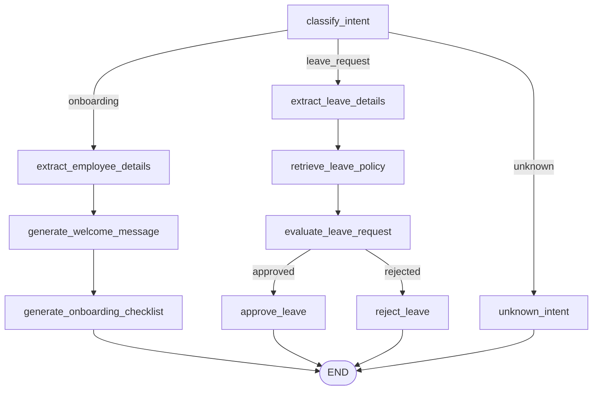
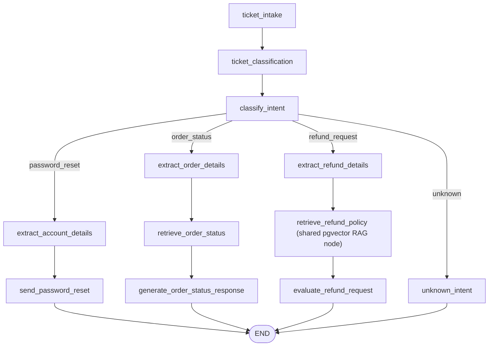
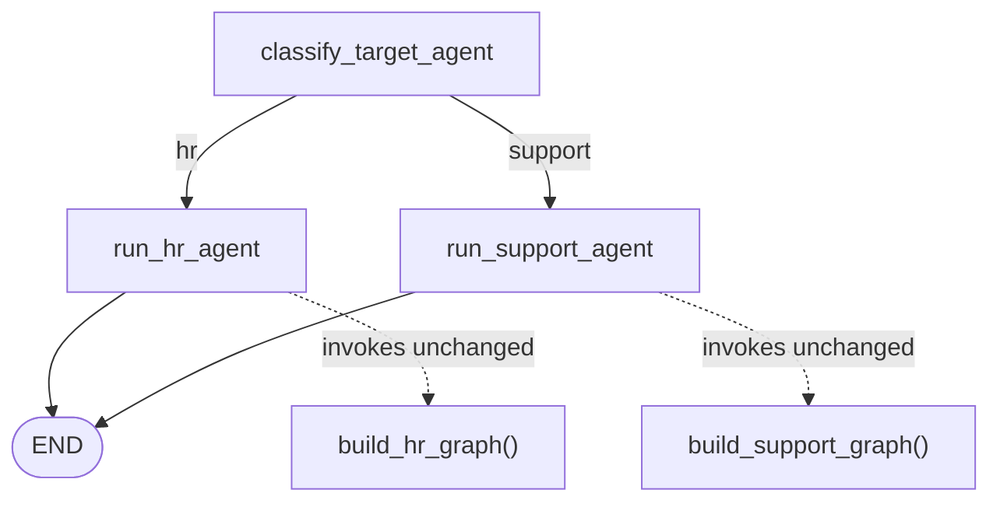

# HR & Support Agents — Product Documentation

This document describes the HR Agent, Support Agent, and the Orchestrator
that routes between them, as they are actually implemented in this
repository today. It consolidates and verifies the existing per-component
docs (`HR_AGENT.md`, `SUPPORT_AGENT.md`, `ORCHESTRATOR.md`, `RAG_DESIGN.md`)
against the current source code. Where the source and those docs disagreed,
the source wins; see [Presentation_Review_Report.md](Presentation_Review_Report.md)
for the specific discrepancies found.

Nothing below describes a feature that does not exist in the code. Where a
capability is a documented placeholder (e.g. order lookups, password reset
delivery), that is called out explicitly rather than presented as complete.

---

## 1. Overview

The AI Employee Suite backend (`backend/app/`) is a FastAPI application that
exposes three conversational, LangGraph-powered agents behind HTTP endpoints,
plus supporting authentication and record-keeping endpoints:

| Component | Endpoint | Purpose |
|---|---|---|
| **HR Agent** | `POST /hr/message` | Employee onboarding and leave-request intake from free text |
| **Support Agent** | `POST /support/message` | Customer support ticket intake, classification, and triage from free text |
| **Orchestrator** | `POST /agent/message` | Single entry point that classifies a message as HR- or Support-domain and dispatches to the matching agent graph |

Both agents are built on a shared scaffold (`backend/app/core/`) so that
LLM access, state shape, and error handling stay consistent. Neither agent
holds conversation memory across requests — every call is a fresh, isolated
graph run (`messages: []` on every initial state).

The repository also contains `sales_agent` and `marketing_agent` modules
under `backend/app/agents/`. **They are out of scope for this document**,
which covers only HR, Support, and the Orchestrator that sits above them.

---

## 2. Features

### HR Agent (`backend/app/agents/hr_agent/`)

- **Intent classification** — routes a free-text message to `onboarding`,
  `leave_request`, or `unknown` via one LLM call (`CLASSIFY_INTENT_PROMPT`).
- **Employee onboarding** — extracts name, role, and start date via regex
  heuristics (`extraction.py`), drafts an LLM-generated welcome message, and
  attaches a static 6-item onboarding checklist.
- **Leave request intake** — extracts leave type (10 keyword categories),
  start/end dates (absolute or relative phrasing), and a free-text reason.
- **Leave policy grounding** — retrieves relevant snippets from a small,
  hardcoded, keyword-matched policy list (`hr_agent/rag.py`) — **not** the
  shared pgvector RAG pipeline (see §4 for why this distinction matters).
- **Rule-based auto-approval** — a leave request auto-approves only if type
  and both dates were successfully extracted; otherwise it routes to a
  manual-HR-review response (never a denial).
- **Employee / Leave Request record-keeping (database-backed)** — separate
  from the conversational graph, `backend/app/api/hr.py` also exposes
  authenticated CRUD endpoints backed by SQLModel tables (`Employee`,
  `LeaveRequest`) — see §6.

### Support Agent (`backend/app/agents/support_agent/`)

- **Universal ticket intake** — every request gets a ticket (`ticket_id`,
  `"Open"` status, keyword-heuristic priority) before any classification
  runs, so there's always a record even for `unknown` requests.
- **Business ticket classification** — every ticket is tagged with one of 7
  categories (`Refund`, `Password Reset`, `Billing`, `Technical Issue`,
  `Account Issue`, `Order Status`, `General Inquiry`, or `Unknown`) plus a
  confidence score, via a strict-JSON LLM prompt. This is independent of
  workflow routing — see §4.
- **Intent routing** — a separate LLM call routes to `password_reset`,
  `order_status`, `refund_request`, or `unknown`.
- **Refund policy grounding via real RAG** — the refund workflow retrieves
  context from the actual pgvector-backed document store via the shared
  `core/rag_node.py` pipeline (see §4), wrapped in try/except for graceful
  degradation.
- **Manual-review-only refund decisioning** — the agent never auto-approves
  or auto-denies a refund; it always sets `refund_decision =
  "pending_manual_review"`.

### Orchestrator (`backend/app/core/orchestrator.py`)

- **Single entry point** — `POST /agent/message` for callers that don't know
  in advance whether a message is HR- or Support-domain.
- **Zero duplication** — invokes the existing, unmodified `build_hr_graph()`
  / `build_support_graph()` compiled graphs; it does not reimplement or
  inspect either agent's internal logic.
- **Support-biased default** — an empty message, LLM failure, or
  unrecognized classifier reply defaults to `"support"` rather than `"hr"`,
  because every Support request unconditionally creates a ticket (see §4),
  so an ambiguous message is never silently dropped.

### Shared reliability behavior (both agents)

- **Graceful LLM degradation** — every LLM-calling node is wrapped by a
  local `_invoke_llm()` helper that returns a deterministic fallback string
  on any exception or empty response, so a Groq outage degrades response
  quality rather than crashing the request.
- **Partial-state-update node contract** — every LangGraph node returns only
  the state keys it changes; nodes never overwrite a field already present
  on incoming state.

---

## 3. Architecture

```
FastAPI app (backend/app/main.py)
    │
    ├─ app.include_router(auth_router)          /auth/*
    ├─ app.include_router(hr_router)             /hr/*   (conversational + CRUD)
    ├─ app.include_router(support_router)        /support/message
    ├─ app.include_router(orchestrator_router)   /agent/message
    │
backend/app/api/
    ├─ hr.py            <- HTTP boundary for HR: /hr/message (graph) +
    │                       /hr/employees, /hr/leaves (DB CRUD, JWT-protected)
    ├─ support.py        <- HTTP boundary for Support: /support/message
    ├─ orchestrator.py   <- HTTP boundary for Orchestrator: /agent/message
    └─ auth.py            <- /auth/signup, /auth/login, /auth/refresh, /auth/admin-only
    │
backend/app/schemas/
    ├─ hr.py              HRAgentRequest / HRAgentResponse
    ├─ support.py         SupportAgentRequest / SupportAgentResponse
    └─ orchestrator.py    OrchestratorRequest / OrchestratorResponse (wraps the two above)
    │
backend/app/agents/
    ├─ hr_agent/
    │   ├─ graph.py       build_hr_graph()
    │   ├─ nodes.py       Node implementations
    │   ├─ state.py       HRAgentState (TypedDict)
    │   ├─ extraction.py  Regex/keyword heuristics
    │   ├─ rag.py          Placeholder keyword-matched policy list
    │   └─ prompts.py      LLM prompt templates
    └─ support_agent/
        ├─ graph.py       build_support_graph()
        ├─ nodes.py       Node implementations
        ├─ state.py       SupportAgentState (TypedDict)
        ├─ rag.py          Order-status lookup placeholder
        └─ prompts.py      LLM prompt templates
    │
backend/app/core/
    ├─ state.py           AgentState (shared base: messages, user_input, agent_response, agent_name, system_prompt)
    ├─ graph.py            Minimal single-node scaffold (not used by HR/Support directly)
    ├─ orchestrator.py    Top-level routing StateGraph (HR vs. Support)
    ├─ llm_client.py       get_llm() -- Groq ChatGroq factory (llama-3.3-70b-versatile, temp 0.3)
    ├─ embeddings.py       BAAI/bge-m3 embedding model (sentence-transformers)
    ├─ retrieval.py        pgvector cosine-distance retrieval (+ SQLite Python fallback), LRU-cached
    ├─ rag_node.py          make_rag_node(top_k) / rag_retrieval_node -- shared LangGraph RAG step
    ├─ jwt_handler.py       Access/refresh token creation & decoding
    ├─ security.py          Password hashing/verification
    └─ dependencies.py      get_current_user, require_role -- JWT auth dependencies
    │
backend/app/models/       SQLModel tables: User, Employee, LeaveRequest, Document
backend/app/db/           database.py -- SQLModel engine/session; API_DOCS.md -- CRUD+auth reference
```

**Design principles consistently applied across both agents:**

- **Separation of HTTP from graph logic** — API routers never touch
  LangGraph internals beyond `.invoke()`.
- **Isolated per-agent state** — `HRAgentState` and `SupportAgentState` each
  extend the shared `AgentState` independently; neither agent's fields leak
  into the other (verified by `test_cross_agent_routing.py`).
- **Reuse over duplication** — the Orchestrator calls the existing agent
  graphs unmodified; the Support Agent's refund workflow reuses the shared
  RAG node rather than maintaining its own retrieval code.
- **Compiled once, invoked per request** — each router builds its compiled
  graph at import time (`_hr_graph = build_hr_graph()`, etc.), since
  compiled LangGraph graphs are stateless and safe to reuse.

---

## 4. LangGraph Workflow

### 4.1 HR Agent graph (`build_hr_graph()`)



- Entry point: `classify_intent`.
- Two conditional-edge selectors: `_route_by_workflow` (reads `state["workflow"]`, defaults `"unknown"`) and `_route_by_leave_decision` (reads `state["leave_decision"]`, defaults `"rejected"` — manual review, never a dead end).
- `retrieve_leave_policy` in this graph calls `hr_agent/rag.py`'s **keyword-matched, hardcoded placeholder list** — it does **not** use the pgvector-backed `core/rag_node.py` pipeline that the Support Agent's refund workflow uses. This is a real, current architectural asymmetry between the two agents (see [Presentation_Review_Report.md](Presentation_Review_Report.md)).

### 4.2 Support Agent graph (`build_support_graph()`)



- Entry point: `ticket_intake`, unconditionally followed by `ticket_classification`, both of which run **before** the workflow fork and never influence which branch is taken.
- Single conditional-edge selector: `_route_by_workflow` (defaults `"unknown"`).
- `retrieve_refund_policy` delegates to `core/rag_node.py`'s `rag_retrieval_node`, which performs real pgvector cosine-distance retrieval (or a Python cosine-similarity fallback on non-Postgres dialects, e.g. local SQLite dev/test) and merges the result into `state["system_prompt"]`.

### 4.3 Orchestrator graph (`build_orchestrator_graph()`)



- `run_hr_agent_node` / `run_support_agent_node` build a fresh `HRAgentState` / `SupportAgentState` (identical shape to what `/hr/message` / `/support/message` build) and invoke that agent's own compiled graph via `.invoke()`. The full result is stored verbatim on `hr_result` / `support_result`.
- `_route_by_target_agent` defaults to `"support"` for any unrecognized value (see §2, "Support-biased default").

### 4.4 Shared RAG pipeline (used by the Support Agent's refund workflow)

```
retrieve_refund_policy_node (support_agent/nodes.py)
    -> rag_retrieval_node (core/rag_node.py, make_rag_node(top_k=3))
        -> retrieve_relevant_docs (core/retrieval.py)
            -> embed_text (core/embeddings.py, BAAI/bge-m3, 1024-dim, normalized)
            -> _cached_retrieve (@lru_cache maxsize=100)
                -> Postgres: pgvector `<=>` cosine-distance query, ORDER BY + LIMIT in SQL
                -> Other dialects (e.g. SQLite): fetch all rows, compute cosine
                   similarity in pure Python, sort, slice to top_k
        -> merges retrieved context into state["system_prompt"]
```

**Known gap (confirmed against `ingest_docs.py`):** only 5 HR-policy sample documents have ever been ingested into the vector store (`source="hr_policy_sample"`); no refund/support-specific documents exist. `retrieve_relevant_docs` has no per-agent/source filter, so a populated multi-domain store would currently mix results across agents. This is documented as a known limitation, not a hidden defect.

---

## 5. APIs

### 5.1 Conversational agent endpoints

| Method | Path | Auth | Description |
|---|---|---|---|
| `POST` | `/hr/message` | None | Run one message through the HR Agent graph |
| `POST` | `/support/message` | None | Run one message through the Support Agent graph |
| `POST` | `/agent/message` | None | Classify HR vs. Support and dispatch to the matching graph |
| `GET` | `/` | None | Backend liveness message |
| `GET` | `/health` | None | Health check (`{"status": "ok"}`) |

### 5.2 Authentication endpoints (`backend/app/api/auth.py`)

| Method | Path | Auth | Description |
|---|---|---|---|
| `POST` | `/auth/signup` | None | Create a user account (`name`, `email`, `password`); password stored hashed |
| `POST` | `/auth/login` | None | Verify credentials, issue `access_token` + `refresh_token` (JWT, bearer) |
| `POST` | `/auth/refresh` | None (valid refresh token in body) | Exchange a refresh token for a new access token |
| `GET` | `/auth/admin-only` | Bearer token, role `admin` | Test endpoint demonstrating role-gated access |

### 5.3 HR record-keeping endpoints (`backend/app/api/hr.py`, database-backed)

These are separate from the conversational `/hr/message` endpoint — they operate directly on the `Employee` and `LeaveRequest` SQLModel tables and require a valid bearer token.

| Method | Path | Auth | Description |
|---|---|---|---|
| `POST` | `/hr/employees` | Bearer token | Create an employee record (`name`, `department`, `position`) |
| `GET` | `/hr/employees` | Bearer token | List all employees |
| `GET` | `/hr/employees/{employee_id}` | Bearer token | Get one employee (404 if not found) |
| `PATCH` | `/hr/employees/{employee_id}` | Bearer token | Update an employee's name/department/position |
| `POST` | `/hr/leaves` | Bearer token | Submit a leave request for an employee (status starts `"pending"`) |
| `GET` | `/hr/leaves` | Bearer token | List all leave requests |
| `PATCH` | `/hr/leaves/{leave_id}` | Bearer token, role `admin` | Update a leave request's status (`approved`/`rejected`) |

> Note: these DB-backed endpoints are **not** wired to the conversational HR Agent graph — a leave request submitted via `/hr/message` does not create a `LeaveRequest` row, and vice versa. They are two independent subsystems sharing the `/hr` prefix.

---

## 6. Example Requests

**HR — Onboarding:**
```bash
curl -X POST http://127.0.0.1:8000/hr/message \
  -H "Content-Type: application/json" \
  -d '{"user_input": "New hire, Jane Smith, joining as a Product Manager starting 2026-08-15."}'
```

**HR — Leave request (auto-approved):**
```bash
curl -X POST http://127.0.0.1:8000/hr/message \
  -H "Content-Type: application/json" \
  -d '{"user_input": "Requesting sick leave from Aug 1 to Aug 3 because of a medical procedure."}'
```

**Support — Refund request:**
```bash
curl -X POST http://127.0.0.1:8000/support/message \
  -H "Content-Type: application/json" \
  -d '{"user_input": "I'\''d like a refund for order #4521, it arrived broken."}'
```

**Support — Password reset:**
```bash
curl -X POST http://127.0.0.1:8000/support/message \
  -H "Content-Type: application/json" \
  -d '{"user_input": "I forgot my password and I'\''m locked out of my account."}'
```

**Orchestrator — unknown source agent:**
```bash
curl -X POST http://127.0.0.1:8000/agent/message \
  -H "Content-Type: application/json" \
  -d '{"user_input": "Please onboard John Doe as a Backend Engineer starting next week"}'
```

**Auth — signup then login:**
```bash
curl -X POST http://127.0.0.1:8000/auth/signup \
  -H "Content-Type: application/json" \
  -d '{"name": "Samia Qadir", "email": "samia@example.com", "password": "changeme123"}'

curl -X POST http://127.0.0.1:8000/auth/login \
  -H "Content-Type: application/json" \
  -d '{"email": "samia@example.com", "password": "changeme123"}'
```

---

## 7. Example Responses

**HR — Onboarding (200):**
```json
{
  "agent_response": "Welcome aboard, Jane! We're excited to have you join us as Product Manager. HR will reach out shortly to guide you through onboarding.",
  "workflow": "onboarding",
  "employee_name": "Jane Smith",
  "employee_role": "Product Manager",
  "start_date": "2026-08-15",
  "onboarding_checklist": [
    "Send offer letter and collect signed contract",
    "Provision company email and accounts",
    "Assign onboarding buddy / manager",
    "Schedule first-day orientation",
    "Collect tax and payroll documentation",
    "Set up workstation / equipment"
  ],
  "leave_type": null,
  "leave_start_date": null,
  "leave_end_date": null,
  "leave_reason": null,
  "leave_decision": null
}
```

**HR — Leave request, auto-approved (200):**
```json
{
  "agent_response": "Your sick leave from Aug 1 to Aug 3 has been approved. Hope the procedure goes well!",
  "workflow": "leave_request",
  "employee_name": null,
  "employee_role": null,
  "start_date": null,
  "onboarding_checklist": null,
  "leave_type": "sick leave",
  "leave_start_date": "Aug 1",
  "leave_end_date": "Aug 3",
  "leave_reason": "a medical procedure",
  "leave_decision": "approved"
}
```

**Support — Refund request, final state (200, abridged):**
```json
{
  "agent_response": "Your refund request has been submitted for manual review.",
  "workflow": "refund_request",
  "ticket_id": "TCK-4F2A9B10",
  "ticket_status": "Open",
  "ticket_category": "Refund",
  "ticket_category_confidence": 0.93,
  "refund_decision": "pending_manual_review"
}
```

**Support — Billing (recognized category, no dedicated workflow branch; demonstrates `ticket_category` and `workflow` are independent):**
```json
{
  "agent_response": "I can currently help with password resets, order status checks, and submitting new refund requests. I'm not yet able to answer general policy questions or check the status of an existing request -- please reach out to support directly for those. Could you tell me more about what you need?",
  "workflow": "unknown",
  "ticket_id": "TCK-1D77B043",
  "ticket_status": "Open",
  "ticket_category": "Billing",
  "ticket_category_confidence": 0.79
}
```

**Orchestrator (200):**
```json
{
  "agent": "hr",
  "hr": {
    "agent_response": "Welcome aboard, John! ...",
    "workflow": "onboarding",
    "employee_name": "John Doe",
    "employee_role": "Backend Engineer",
    "start_date": "Unknown"
  },
  "support": null
}
```

**Auth — login (200):**
```json
{
  "access_token": "<jwt>",
  "refresh_token": "<jwt>",
  "token_type": "bearer"
}
```

---

## 8. Error Handling

### 8.1 Conversational agent endpoints (`/hr/message`, `/support/message`, `/agent/message`)

All three follow the identical pattern:

| Status | Cause |
|---|---|
| `422 Unprocessable Entity` | Missing/empty/wrong-type `user_input`, or malformed JSON body — Pydantic validation runs before the graph is ever invoked |
| `500 Internal Server Error` | The graph raised an exception during `.invoke()` (logged server-side via `logger.exception`), or the graph completed without producing a truthy `agent_response` (logged via `logger.error`) |

No raw Python traceback is ever returned to the client — every `500` carries a `detail` string. The Orchestrator additionally defends against a sub-graph result missing expected keys: `api/orchestrator.py` reads every field via `.get(key, default)` rather than a blind dict-spread, so an incomplete `hr_result`/`support_result` degrades to sensible defaults (e.g. `workflow: "unknown"`) instead of raising an unhandled `pydantic.ValidationError`. This defensive pattern was added after a real gap was found during the Orchestrator's integration testing (see `ORCHESTRATOR.md` §7–8).

**Example 422:**
```json
{
  "detail": [
    {
      "type": "string_too_short",
      "loc": ["body", "user_input"],
      "msg": "String should have at least 1 character",
      "input": ""
    }
  ]
}
```

**Example 500:**
```json
{ "detail": "HR agent failed to process the request" }
```

### 8.2 LLM-level failure handling (inside the graph, not surfaced as an HTTP error)

Every node that calls the LLM is wrapped by `_invoke_llm()` (HR and Support each define their own copy, identical in behavior). A network error, missing/invalid `GROQ_API_KEY`, provider outage, rate limit, or an unexpectedly empty response is caught, logged via `logger.exception`, and replaced with a hand-written deterministic fallback string — the graph still completes and the HTTP request still returns `200`. This means a Groq outage degrades response *quality*, not availability.

### 8.3 RAG retrieval failure handling

`retrieve_leave_policy_node` (HR) and `retrieve_refund_policy_node` (Support) both wrap their retrieval call in try/except: a failure (network, DB, embedding model) is logged and the graph continues with no policy context rather than crashing.

### 8.4 Database/auth endpoints

- `404 Not Found` — employee or leave request ID doesn't exist.
- `401 Unauthorized` — missing/invalid/expired bearer token, or wrong token type (e.g. a refresh token used where an access token is required).
- `403 Forbidden` — valid token, but the user's role isn't in the endpoint's allowed-roles list (`require_role`).
- `400 Bad Request` — signup with an email that's already registered.

---

## 9. Testing

All 205 HR/Support/Orchestrator/cross-agent/retrieval tests pass as of this
writing (verified by running the suite during preparation of this document):

```bash
python -m pytest test_hr_agent.py test_hr_agent_extraction.py test_hr_agent_nodes.py \
    test_hr_agent_graph.py test_hr_agent_comprehensive.py test_hr_agent_api.py \
    test_support_agent_graph.py test_support_agent_nodes.py test_support_agent_sample_tickets.py \
    test_support_agent_comprehensive.py test_support_agent_api.py test_support_agent_resilience.py \
    test_cross_agent_routing.py test_orchestrator_routing.py test_retrieval.py -q

# 205 passed, 3 warnings, 53 subtests passed
```

The 3 warnings are pre-existing, unrelated deprecation notices (`httpx`/Starlette `TestClient`, FastAPI `on_event`) — see §10.

All tests are deterministic and require no network access or `GROQ_API_KEY`; the LLM is stubbed via `unittest.mock.patch` on each module's `get_llm`. A separate opt-in suite, `test_live_llm_accuracy.py`, exercises the real Groq model when `GROQ_API_KEY` is set (auto-skips otherwise).

---

## 10. Known Gaps (explicitly not guessed away)

The following are real, current limitations confirmed against source. They are listed here rather than omitted, per the instruction to state missing information explicitly rather than inventing completeness:

- **HR's leave-policy retrieval is not the shared RAG pipeline.** `hr_agent/rag.py` does simple keyword matching over 4 hardcoded strings — it does not query the pgvector document store the way the Support Agent's refund workflow does. Anyone assuming both agents are "RAG-grounded" in the same way would be incorrect.
- **No conversation memory.** Every request is a fully independent graph invocation; there is no session/thread persistence (LangGraph checkpointing is not wired up).
- **Extraction is regex/keyword-based, not NLU.** Unusual phrasing in either agent's extraction step falls back to `"Unknown"`/`"Unspecified"` rather than being understood.
- **No real backend integrations.** Password reset, order status lookup, and refund decisioning are all placeholders (no auth system, order-management system, or payments system is actually called).
- **`requirements.txt` is incomplete.** It lists only `fastapi`, `uvicorn`, `sqlmodel`, `psycopg2-binary`, `python-dotenv`, `SQLAlchemy`, and `sentence-transformers` — it does not list `langgraph`, `langchain-groq`, `pgvector`, `pytest`, or `httpx`, all of which the running code and test suite actually depend on (confirmed by reading the file directly).
- **`main.py` uses the deprecated FastAPI `@app.on_event("startup")` hook**, producing a `DeprecationWarning` on every test run (confirmed above).
- **Only HR sample documents exist in the vector store**, and retrieval has no per-source/per-agent filter.
